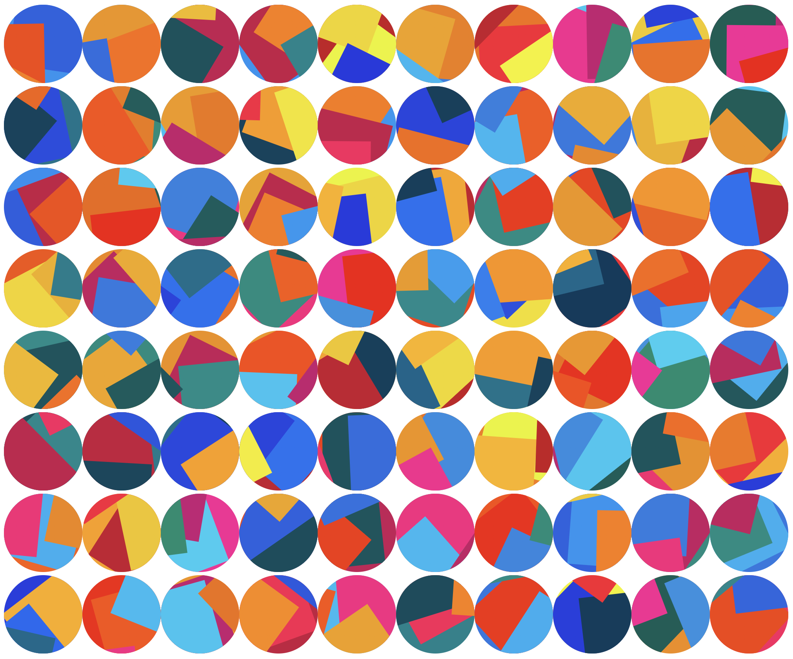

# Jazzicon
## Jazzy Identicons

[Live Example](http://requirebin.com/?gist=64341df46d79cc72567417c022e9d0ee)

Say goodbye to boring blocky identicons that look like they came out of the 70s, and replace them with jazzy, colorful collages that more likely came out of the 80's.



## Installation

```
npm install jazzicon -S
```

## Usage

Takes a pixel diameter and a javascript integer (seeds the shape), and gives you back a DOM element to use as you wish!

```javascript
var jazzicon = require('jazzicon')

var body = document.querySelector('body')
for(var i = 0; i < 60; i++) {
  var el = jazzicon(100, Math.round(Math.random() * 10000000))
  body.appendChild(el)
}
```

## Example

You can run an example by installing beefy (`npm i -g beefy`) and then running `npm run sample`.
